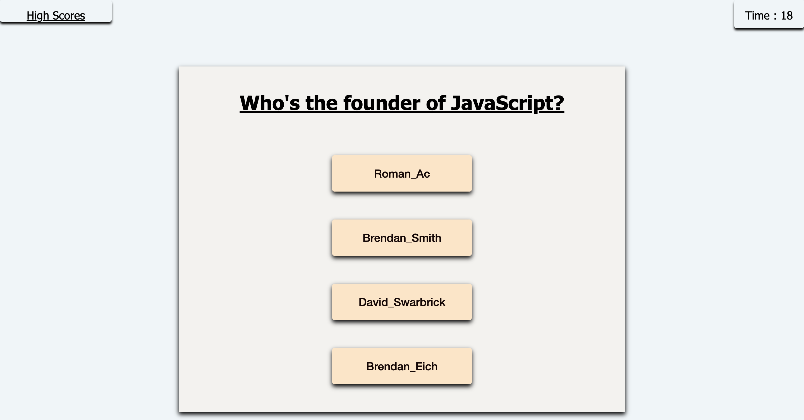

# <Code-Quiz-by-Roman_Ac>

# Mission
    * to build a timed coding quiz with multiple-choice questions
    * to feature dynamically updated HTML & CSS
    * have a clean, polished and responsive user interface

# Parameters
    
    * minimum of 2 multiple choice questions
    * when start button is clicked, timer starts and first question is served
    * upon answering question 1, second question is presented
    * if answered incorrecytly 10 secs of time to be deducted
    * When all questions are answered or clock reaches "0", whichever comes first, game is over
    * when game is over user is to save result with his/her initials

# Link to the page

# Screenshot

    

